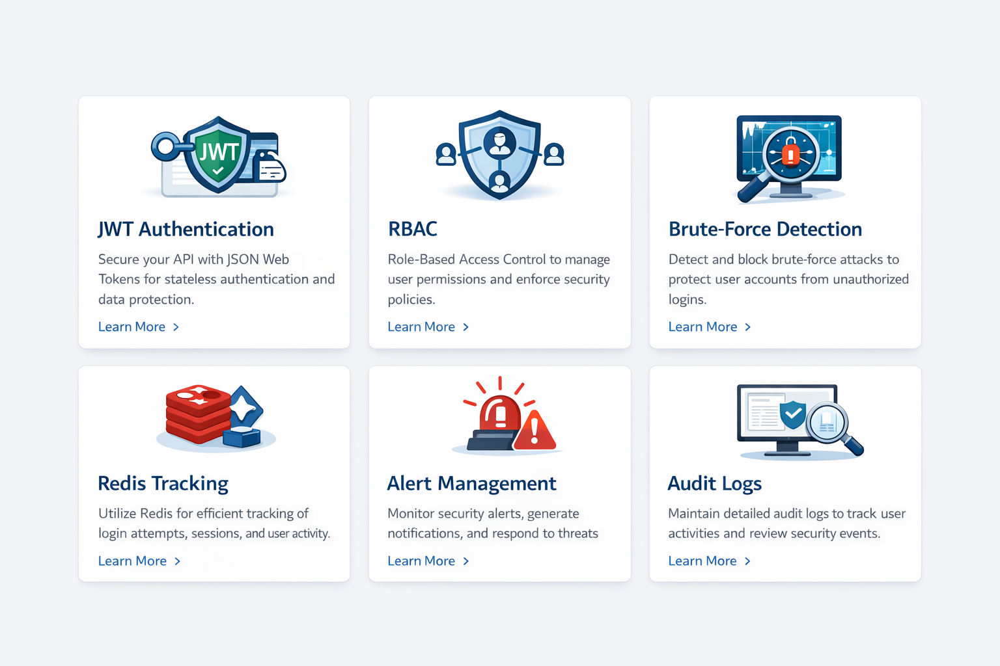
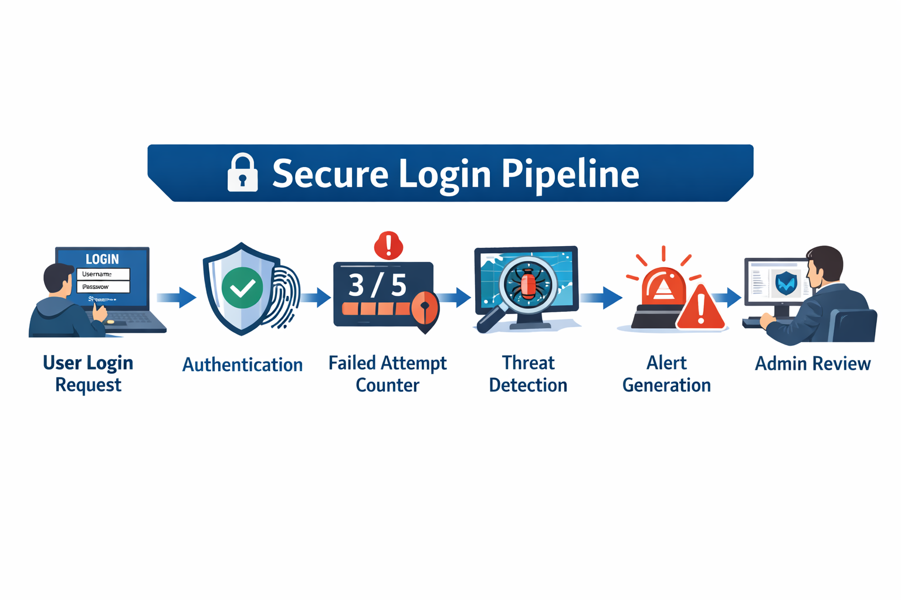

# 🛡 CyberSec Log System


[]()
[]()
[]()
[]()
[]()
[]()

A **Spring Boot based cybersecurity detection system** designed to monitor login activity, detect brute-force attacks, generate alerts, and provide admin visibility into suspicious authentication events.

This project demonstrates **real-world security engineering practices**, including:

* JWT authentication
* RBAC authorization
* Redis-backed attack detection
* Security event logging
* Admin alert management

---

# 📌 Table of Contents

* Overview
* System Architecture
* Features
* Secure Login Pipeline
* Request Lifecycle
* Security Model
* Technology Stack
* API Endpoints
* Local Setup
* Configuration
* Roadmap
* Screenshots
* Contribution

---

# 🚀 Overview

Most authentication systems only verify credentials.

This system adds a **security intelligence layer** that actively detects suspicious behavior.

### Core Capabilities

* Detect brute-force login attempts
* Track suspicious authentication patterns
* Generate automated security alerts
* Provide admin investigation tools
* Maintain immutable audit logs

---

# 🏗 System Architecture


The system follows a **layered modular architecture** designed for security monitoring pipelines.

### Core Layers

**Controller Layer**

* Handles authentication requests
* Exposes admin monitoring APIs

**Service Layer**

* Authentication service
* Detection orchestration

**Detection Engine**

* Brute-force detection rules
* Suspicious pattern analysis

**Storage Layer**

* Redis counters
* Relational database logs

---

# ✨ Features

### 🔐 JWT Authentication

Secure token-based authentication.

* Stateless session management
* Token verification filter
* Secure API access

---

### 👥 Role-Based Access Control (RBAC)

Authorization model with two roles:

* **USER**
* **ADMIN**

Admin-only endpoints manage security alerts.

---

### 📉 Failed Login Tracking

Redis-backed counters track failed login attempts.

Benefits:

* Extremely fast
* Scalable
* Supports real-time detection

---

### 🚨 Threat Detection Engine

Automatically detects:

* Rapid login failures
* Suspicious login bursts
* Possible brute-force attacks

Triggers **security alerts** when thresholds are exceeded.


---

### 🧾 Security Audit Logs

All important events are logged.

Examples:

* Login attempts
* Alert generation
* Alert resolution
* Admin actions

---

### 🛡 Admin Security APIs

Admins can:

* View alerts
* Investigate events
* Mark alerts as resolved

---

# 🔐 Secure Login Pipeline


Pipeline flow:

```
User Login Request
        ↓
Authentication Layer
        ↓
Failed Attempt Counter (Redis)
        ↓
Threat Detection Engine
        ↓
Alert Generation
        ↓
Admin Investigation
```

---

# 🔄 Request Lifecycle


1️⃣ Client sends login request
2️⃣ Authentication validates credentials
3️⃣ Redis tracks failed login attempts
4️⃣ Detection engine evaluates suspicious patterns
5️⃣ Alert generated if threshold reached
6️⃣ Admin retrieves alert
7️⃣ Alert marked resolved

---

# 🔐 Security Model

### Authentication

JWT-based authentication.

### Authorization

Spring Security RBAC model.

```
USER → basic endpoints
ADMIN → alert management endpoints
```

### Defense Mechanisms

* Failed login tracking
* Attack pattern detection
* Admin monitoring

### Auditability

All security events are persisted for forensic analysis.

---

# 🧰 Technology Stack


| Layer       | Technology                 |
| ----------- | -------------------------- |
| Core        | Java 17, Spring Boot       |
| Security    | Spring Security, JWT       |
| Persistence | Spring Data JPA, Hibernate |
| Caching     | Redis                      |
| Build       | Maven                      |
| Containers  | Docker                     |
| Testing     | Postman                    |

---

# 📡 API Endpoints

### Authentication

```
POST /auth/register
POST /auth/login
```

### Admin Alerts

```
GET /admin/alerts
GET /admin/alerts/{id}
PATCH /admin/alerts/{id}/resolve
```

---

# ⚙ Local Setup

### Prerequisites

* JDK 17
* Maven
* Docker
* Redis

---

### Run the System

From project root:

```bash
docker compose up -d
```

This starts:

* Redis
* Database
* Spring Boot service

---

# ⚙ Configuration

Configuration uses **Spring profiles**.

```
application.yml
application-dev.yml
application-prod.yml
```

Best practices:

* Store secrets in environment variables
* Never commit JWT secrets
* Rotate credentials before production deployment

---

# 🗺 Project Roadmap


### Phase 1 (Completed)

* Brute-force detection
* JWT authentication
* RBAC authorization
* Alert system
* Security logs

### Phase 2

* Admin monitoring dashboard
* Kafka event streaming
* Advanced anomaly detection

### Phase 3

* ML-based attack detection
* SIEM integration

---

# 🤝 Contribution

Contributions are welcome.

Steps:

1. Fork repository
2. Create feature branch
3. Submit pull request

---

# ⭐ Support

If you find this project useful, consider giving it a **GitHub star**.

---

